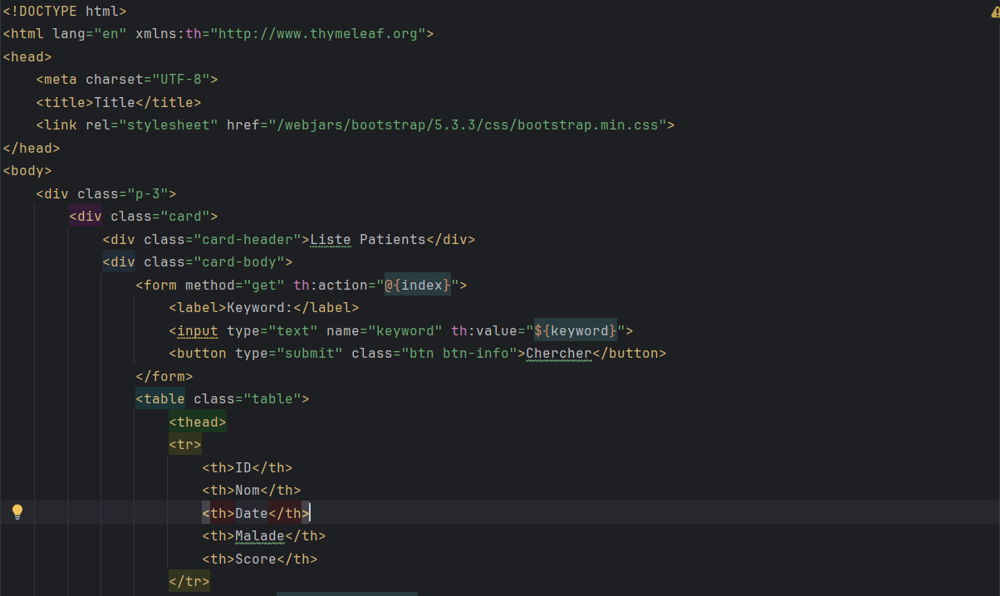

**<h3>Compte rendu<h3>

<h4>- On creer 3 packages entities et repository et web</h4>

<h4>- Dans entities on creer l'entite jpa Patient </h4>

<h4>- Grace à Lombok, on peut utiliser l'annotation @Data pour avoir
les getters et les setters ainsi que la methode Tostring, on peut aussi utiliser @NoArgsConstructor pour
le constructeur sans parametre et @AllArgsConstructor pour le constructeur avec parametre</h4>

<h4>- Dans repository on creer l'interface PatientRepository</h4>

<h4>- Dans HopitalTP3Application, on implemente linterface CommandeLineRunner pour executer un traitement au demarage, on fait appele
a PatientRepository et on fait l'injection des dependences en utilisant @Autowired et on declare 3 patients :</h4>

<h4>- Dans la couche Web On creer un controlleur , on fait appelle a PatientRepository, on fait l'injection des dependences en utilisant le constructeur avec parametre apres on retourne une view Patient, et grace à @GetMapping("/index") si on tape localhost:8084/index ca va nous retourner une view patients.html</h4>

<h4>Dans la vue patients.html on creer une page Html en utilisant bootstrap :</h4>

<h4>La page retourner apres avoir taper localhost:8084/index :</h4>

